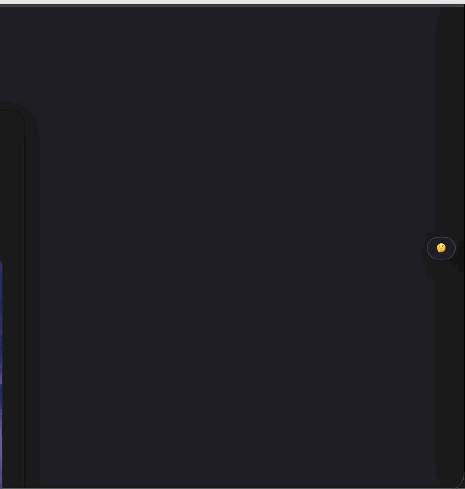

## Cloudflare Worker AIS  - Artificial Intelligence Summary


> 支持图片内容，文本内容。


本地开发： `npx wrangler dev --port 80  --local`


### 部署worker

* [worker.js](worker.js) - worker 代码
* [wrangler.toml](wrangler.toml.prod) - 配置ENV


* ENV VARIABLES

  * OPENAI_API_BASE - The default base URL for OpenAI API requests   `optional`
  * OPENAI_API_KEY - Your OpenAI API key for accessing the language model
  * SUM_MODEL - The model to use for summarization (default: glm-4v-flash)  `optional`
  * DOMAIN_BIND - domain whitelist


### 放入 HTML 页面

```html

<script src="/web/summarizer.js"
        data-worker="http://localhost/embed/summarizer"
        data-css="/web/summarizer.css"
        data-images="base64"
>
</script>

```

### Changelog

* 支持文本内容总结。
* 支持图片内容总结。
* 支持多apikey轮训，可以让各位手中的openai key 发挥更大作用。
* `DOMAIN_BIND` 白名单功能，防止滥用。


### Demo 




